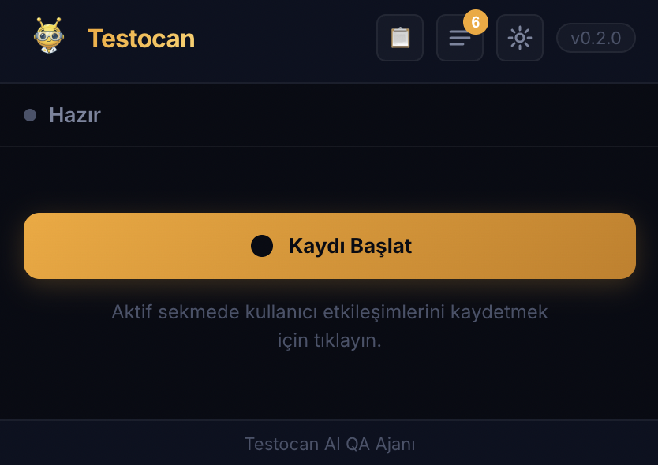
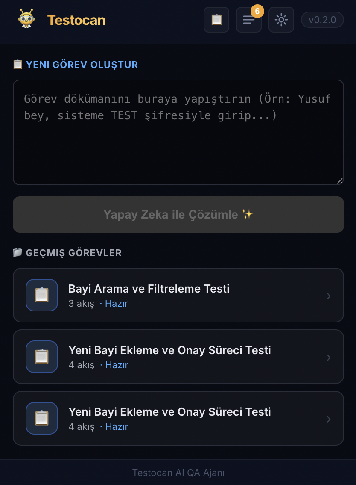
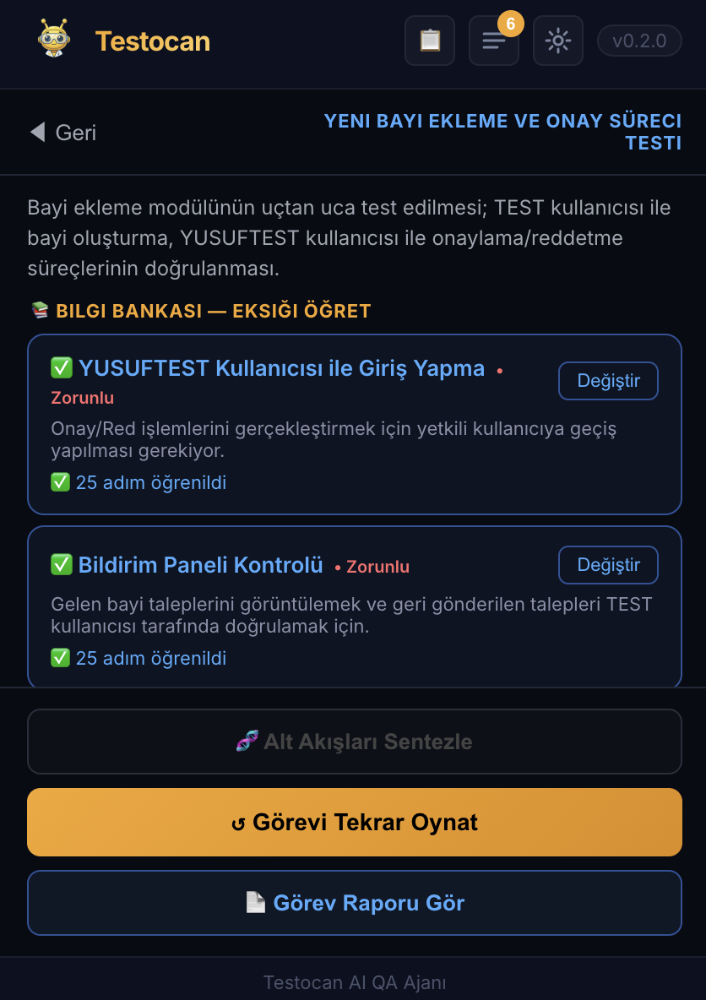
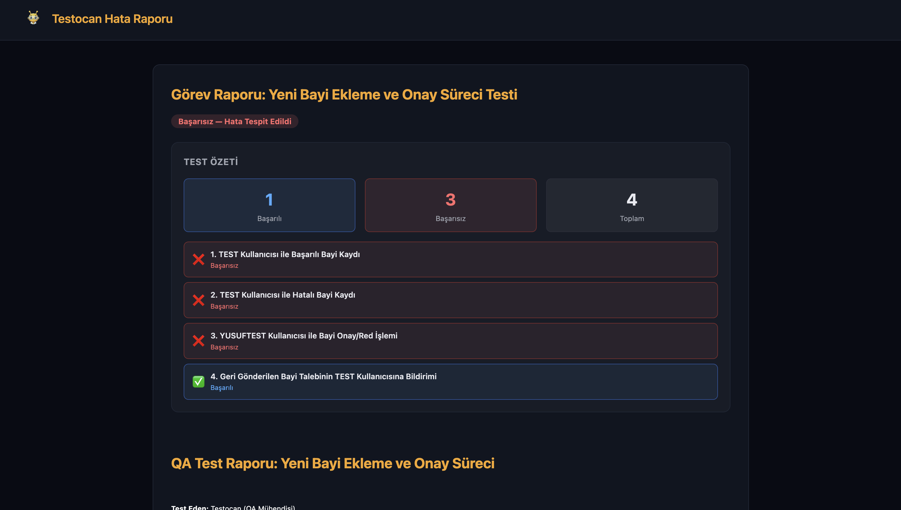

<p align="center">
  
</p>

<h1 align="center">🐝 Testocan</h1>
<p align="center">
  <strong>AI destekli Chrome uzantısı ile web testlerinizi otomatize edin.</strong><br/>
  Kaydet. Oynat. Analiz et. Hataları raporla.
</p>


<p align="center">
  
  
  
  
  
</p>

---

## 📖 Proje Hakkında

**Testocan**, web uygulamalarını manuel olarak test etme sürecini yapay zeka ile otomatize eden bir Chrome uzantısıdır. Test ekipleri ve geliştiriciler için tasarlanmış olan Testocan; kullanıcı hareketlerini kaydeder, bu hareketleri akıllı seçicilerle oynatır, hataları otomatik tespit eder ve Gemini AI ile zengin Türkçe hata raporları üretir.

### Neden Testocan?

Geleneksel test araçları ya karmaşık yapı gerektirir (Selenium, Playwright) ya da sadece basit kayıt-oynat işlevi sunar. Testocan ikisini birleştirir ve üzerine AI katmanı ekler:

- **Kaydet:** Tarayıcıda yaptığın her hareketi (tıklama, yazma, gezinme) kaydeder
- **Oynat:** Self-healing seçicilerle aynı adımları otomatik tekrarlar
- **Analiz et:** Ağ hatalarını, konsol hatalarını, başarısız adımları tespit eder
- **Raporla:** Gemini AI ile detaylı, Türkçe QA raporları üretir

---

## ✨ Özellikler

### 🎬 Akış Kaydı & Oynatma
- Her click, input, scroll, navigation olayını yakalar
- Oynatma sırasında self-healing locator: CSS seçici → aria-label → id → innerText sırasıyla dener
- Akış hızı kontrolü (yavaş / normal / hızlı)
- Kayıtları isimlendirip kaydedebilir, geçmişten yönetebilirsin

### 🤖 AI Destekli Görev Orkestratörü
Büyük test görevlerini doğal dille tanımla, AI senin için:
1. Görevi anlamlı test senaryolarına böler
2. Primary test kaydını analiz eder, öğrenmesi gereken eksik eylemleri tespit eder
3. **Bilgi Bankası (Knowledge Bank)** ile her eksik eylemi ayrı mini-kayıtla öğrenir (çıkış yapma, bildirim açma, form onaylama vb.)
4. Öğrenilen tüm kayıtları birleştirerek diğer akışları sentezler
5. Tüm görev tamamlandığında kapsamlı bir QA raporu üretir

### 📊 Gelişmiş Hata Raporlama
- Ağ isteklerini ve HTTP hata kodlarını yakalar
- JavaScript konsol hatalarını raporlar
- Başarısız UI adımlarını (hangi element, ne hatası) açıklar
- Son ekran görüntüsünü rapora ekler
- **Şifre ve hassas bilgileri gizler** (`[GÜVENLİK NEDENİYLE GİZLENDİ]`)
- Türkçe, profesyonel QA raporu formatında sunar

### 🔍 Görev Bazlı Test Akışı

```
Görev Gir (doğal dil)
      ↓
AI Akışlara Böler
      ↓
Primary Kaydı Seç & Analiz Et
      ↓
📚 Bilgi Bankası — Eksik Eylemleri Öğret
  ❓ Çıkış Yapma     → [● Öğret] → mini kayıt seç → ✅
  ❓ Bildirim Açma   → [● Öğret] → mini kayıt seç → ✅
      ↓
Alt Akışları Sentezle (AI bilgi bankasını kullanır)
      ↓
Görevi Oynat → Görev Raporu
```

### 🎯 Assertions (Beklenti Kontrolleri)
- Sayfa üzerinde görünür olmayan / olması gereken metinleri kontrol eder
- Ağ isteği başarısının doğrulanması
- Assertion sonuçları rapora yansır

### 🔗 Jira Entegrasyonu
- Hata raporunu doğrudan Jira issue olarak açabilirsin
- Bug, Task veya Story olarak oluşturulabilir

---

## 🏗️ Mimari

```
testocan-extension/
├── src/
│   ├── background/
│   │   └── index.js          # Service Worker — olay koordinasyonu, replay motoru
│   ├── content/
│   │   ├── index.js          # Sayfa olaylarını dinler ve background'a iletir
│   │   └── injected.js       # DOM üzerinde çalışan replay executor
│   ├── popup/
│   │   └── App.jsx           # React UI — tüm ekranlar ve görev orkestratörü
│   ├── report/
│   │   └── main.js           # QA raporu viewer (Markdown → HTML)
│   └── shared/
│       └── geminiClient.js   # Gemini API entegrasyonu (analiz, sentez, raporlama)
├── manifest.json             # Chrome MV3 manifest
└── vite.config.js
```

### Temel Bileşenler

| Bileşen | Görev |
|---|---|
| `content/index.js` | Kullanıcı hareketlerini (click, input, scroll...) yakalar ve background'a gönderir |
| `content/injected.js` | Replay sırasında DOM elementlerini bulur ve etkileşimde bulunur |
| `background/index.js` | Kayıt/oynatma durumunu yönetir; task run orkestratörünü çalıştırır |
| `popup/App.jsx` | 4 ekran yönetir: IDLE, RECORDING, REPLAY, TASKS |
| `geminiClient.js` | AI analizi, gap tespiti, akış sentezi ve rapor üretimini yapar |

---

## 🚀 Kurulum

### Gereksinimler
- Google Chrome (veya Chromium tabanlı bir tarayıcı)
- Node.js 18+
- [Google AI Studio](https://aistudio.google.com/apikey) üzerinden alınmış **Gemini API anahtarı**

### Adımlar

```bash
# Repoyu klonla
git clone https://github.com/kullanici-adin/testocan-extension.git
cd testocan-extension

# Bağımlılıkları yükle
npm install

# Uzantıyı derle
npm run ext:build
```

Ardından Chrome'da:
1. `chrome://extensions` adresine git
2. Sağ üstten **"Geliştirici Modu"**nu aç
3. **"Paketlenmemiş uzantı yükle"** → `dist/` klasörünü seç
4. Uzantı araç çubuğuna sabitle

---

## ⚙️ Yapılandırma

Uzantıyı ilk açtığında **Ayarlar (⚙️)** sekmesine gel:

### Gemini API
- [Google AI Studio](https://aistudio.google.com/apikey)'dan ücretsiz API anahtarı al
- Anahtarı **Gemini API Anahtarı** alanına gir ve kaydet
- Akıl yürütme, sentez ve raporlama için kullanılır

### Jira (İsteğe Bağlı)
- Jira URL, e-posta, API token ve proje kodu gir
- Hata raporlarını doğrudan Jira'ya gönderebilirsin

---

## 📋 Kullanım

### 1. Tekil Akış Kaydı

1. Test edeceğin web sayfasını aç
2. Uzantıyı aç → **"Kaydı Başlat"** butonuna bas
3. Sayfada normal test adımlarını gerçekleştir
4. **"Kaydı Durdur"** → akışı isimlendir ve kaydet
5. **"Oynat"** ile akışı otomatik tekrarla

### 2. AI Destekli Görev Testi

1. **Görevler (📋)** sekmesine geç
2. Görev açıklamanı yapıştır (doğal dil — mesaj, e-posta, döküman formatında olabilir)
3. **"Yapay Zeka ile Çözümle"** → AI akışlara böler
4. Görevin üzerine tıkla
5. **"Birincil Akış Seç & Analiz Et"** → kaydını seç
   - AI hangi eylemleri bildiğini, hangilerinde hâlâ eksik olduğunu tespit eder
6. Eksik eylemler için **"● Öğret"** → ilgili mini kaydı seç
7. **"Alt Akışları Sentezle"** → AI bilgi bankasıyla sentezler
8. **"Görevi Oynat"** → tam görev çalışır
9. Tamamlandığında **"Görev Raporu Gör"** → AI hazırladığı rapora bak

### Örnek Görev Girdisi

```
Selam Yusuf, yeni bayi ekleme modülünü tamamladım, testlere başlayabilirsin.
Test kullanıcıları: YUSUFTEST ve TEST, ikisinin de şifresi test1234.

Önce TEST kullanıcısıyla giriş yap. Bayi İşlemleri ekranına git,
"Yeni Bayi" butonuna bas, formu eksiksiz doldur ve onayla.
Ardından çıkış yap, YUSUFTEST ile giriş yap ve bildirimleri kontrol et.
```

---

## 📸 Ekran Görüntüleri

### Ana Ekran — Kayıt Öncesi


### Görev Orkestratörü & Akış Listesi


### Bilgi Bankası — Eksik Eylemleri Öğret


### AI Tarafından Üretilen QA Raporu


---

## 🧠 Gemini AI Entegrasyonu

Testocan, **Google Gemini API** kullanarak şu işlemleri yapar:

| Metot | Açıklama |
|---|---|
| `splitTask(prompt)` | Doğal dil görevini test senaryolarına böler |
| `analyzeKnowledgeGaps(...)` | Primary kaydı analiz eder, hangi eylemlerin öğretilmesi gerektiğini tespit eder |
| `synthesizeTaskFlow(lessonFlows, target)` | Birden fazla kayıttan öğrenilenleri birleştirerek yeni akış oluşturur |
| `enhanceReport(report)` | Ham hata verisini profesyonel Türkçe QA raporuna dönüştürür |
| `enhanceTaskReport(taskData)` | Tüm görev sonuçlarını kapsamlı rapor haline getirir |

### Güvenlik
- API anahtarı yalnızca `chrome.storage.local`'de saklanır, dışarıya sızmaz
- Şifre ve hassas bilgiler raporlarda otomatik olarak maskelenir

---

## 🛠️ Geliştirme

```bash
# Watch modda geliştir (değişiklikler anında derlenir)
npm run dev

# Production build
npm run ext:build
```

`npm run dev` komutu `dist/` klasörünü sürekli günceller. Chrome uzantısında **"Uzantıyı yenile"** tuşuna basarak değişiklikleri görürsün.

### Klasör Yapısı — Yeni Özellik Ekleme

- **Yeni mesaj tipi:** `background/index.js`'deki `MSG` objesine ekle → handler yaz → popup'ta `sendMsg(MSG.YENI_MESAJ, ...)` ile çağır
- **Yeni ekran:** `popup/App.jsx`'te `VIEW` enum'una ekle → `App` bileşenindeki render mantığını güncelle
- **Yeni AI özelliği:** `geminiClient.js`'e `static async` metot ekle

---

## 📄 Lisans

MIT © Testocan

---

<p align="center">
  Yapay zeka ile QA'yı daha kolay hale getiriyoruz 🐝
</p>
